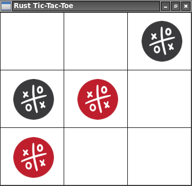

# rust-tic-tac-toe

[](https://travis-ci.org/jean553/rust-tic-tac-toe)



Useless tic-tac-toe game. My only goal was to practice using Rust.

## Start

```
cargo run
```

## Commands

 * left click: add a pin,
 * right click: restart the game

## Credits

Icons - Free for commercial use - https://www.iconfinder.com/quizanswers
